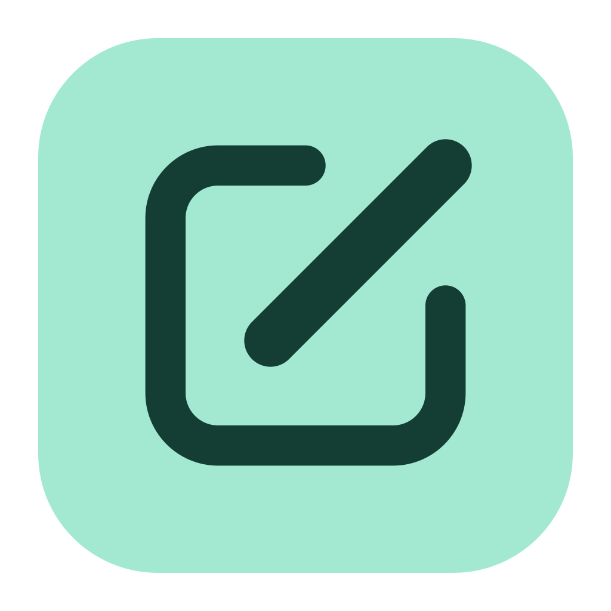

# Glassboard

A small desktop annotation tool for macOS and Windows. Switch from work to annotation with a shortcut, draw over your screen, then switch back. Every annotation session starts clear.

Built with Rust, Tauri 2, Svelte 5, TypeScript, and Canvas 2D. Everything runs locally. There is no account, server, screen recording, or network service in the built app.

## Run locally

Install Node.js 22.12+ (or a newer supported LTS), Rust stable, and the [Tauri prerequisites](https://v2.tauri.app/start/prerequisites/) for your OS. macOS needs the Xcode Command Line Tools. Windows needs the C++ Build Tools and WebView2.

```sh
npm ci
npm run desktop tauri dev
```

The repository is an npm workspace. The desktop app lives in `apps/desktop`, the
[glassboard.dev](https://glassboard.dev) landing page in `apps/web`, and the drawing
engine, session adapter, and toolbar they share in `packages/ui`. Root scripts forward
to each workspace: `npm run desktop <script>`, `npm run web <script>`, and
`npm run ui <script>`. Use `npm run desktop dev` (or `npm run web dev`) for browser previews.

The app starts in work mode with the desktop usable. On first launch, a short tutorial invites you to draw a mark and use the global shortcut to return to work. The toolbar stays open during practice. Completing or skipping the tutorial is remembered; choose **Show tutorial** in settings to replay it. After the tutorial, the drawing toolbar tucks away as a thin pill at the edge of the display. Move the cursor near the pill to open the toolbar; it collapses again shortly after the cursor leaves. It stays open while an error is showing or a control has keyboard focus. Hover over a tool or color (or focus it with Tab) to see its name and shortcut. Tooltips open toward the screen interior, outside the scrolling toolbar, so they remain visible in every dock position. The toolbar and settings follow the system light/dark appearance and update when it changes. The toolbar is docked: choose **Left**, **Right**, or **Bottom** under **Toolbar position** in settings. It stays centered along the selected edge of the active display’s usable area. Side toolbars are vertical; the bottom toolbar is horizontal. The selection saves automatically. Click the menu-bar/system-tray icon to open settings. Right-click it for **Clear screen** and **Quit Glassboard**.

For a browser-only UI preview, run `npm run desktop dev` and open http://127.0.0.1:1420. The preview draws within that tab; desktop overlay behavior requires Tauri. Shortcut preferences in the preview are illustrative; its show/hide binding stays at the default.

## Controls

A mint-green glow along each display’s edges indicates annotation mode, including when the toolbar is collapsed. It fades in briefly, stays steady, and disappears immediately when returning to work. The fade-in respects the system’s reduced-motion preference.

| Action | macOS | Windows |
| --- | --- | --- |
| Annotate / work (global, configurable) | Cmd+Shift+A | Ctrl+Shift+A |
| Hide while drawing | Escape | Escape |
| Arrow / Pen / Square / Circle | Cmd+1 / 2 / 3 / 4 | Ctrl+1 / 2 / 3 / 4 |
| Eraser / Text / Highlighter | Cmd+E / T / H | Ctrl+E / T / H |
| Colors (Rainbow through Blue) | 1–8 | 1–8 |
| Undo / redo | Cmd+Z / Cmd+Shift+Z | Ctrl+Z / Ctrl+Shift+Z |

Tools, left to right: **Arrow** (⌘1), **Pen** (⌘2), **Square** (⌘3), **Circle** (⌘4), **Eraser** (⌘E), **Text** (⌘T), and **Highlighter** (⌘H). Use **Ctrl** instead of **⌘** on Windows. Pen draws a freehand stroke in the current color at Regular width. Text places an inline editor where you click: type, press **Enter** to commit, **Shift+Enter** for a new line, or **Escape** to discard; clicking elsewhere or switching tools commits. Text uses a fixed 24 px size. The eraser removes any shape you click or drag across, as a single undo step. The annotate/work shortcut is the only global one; tool/color shortcuts and undo/redo work when a Glassboard window has keyboard focus. There is no click-through mode: return to work to use other apps. The aim is for the toolbar to be optional: every control on it should eventually have a shortcut. Erasing supports undo/redo and retains the original auto-fade deadline.

Hold **Shift** while dragging to constrain arrows to 45-degree increments or draw squares and circles. Text uses the same color, color mode, and auto-fade as other shapes. Colors sit directly on the toolbar in this order: **Rainbow**, **Shifting**, **Black**, **White**, **Green**, **Yellow**, **Red**, and **Blue**, selected with **1–8** in that order (no modifier). Number keys type normally while editing text. Rainbow is the default for new preferences; an explicitly saved mode is remembered. Rainbow gives every tool a gradient blending coral red, warm yellow, mint green, aqua, sky blue, violet, and pink, with a random starting color for each new shape. Its hues shift with your drag and freeze on release. Shifting steps through the same seven colors with each completed shape, across displays. Cancelled strokes, undo, redo, and clear do not advance the cycle. Line width is fixed at Regular for all drawing tools. The auto-fade button cycles **∞ → 3s → 5s → 10s → ∞** and remembers your selection. New shapes use the duration selected when drawing starts; their timer begins on release, with a soft fade during the final half-second. ∞ keeps drawings for the current annotation session unless cleared manually. Changing the duration leaves existing drawings unchanged, and expired drawings stay removed through undo/redo. Click the menu bar / system tray icon to open a separate settings window beside the icon. The window opens below a top menu bar or above a bottom taskbar, stays within the display, and dismisses on Escape or when it loses focus. It contains the annotate/work shortcut, toolbar position, clear-all, and quit controls. To change the global annotate/work shortcut, click the shortcut field and press the new combination; it saves immediately. Escape cancels recording, and the reset button restores the default. The shortcut must include Command/Control, Control, Super, or Alt. Conflicting registrations show an error without replacing the working shortcut.

Leaving annotation mode hides the overlay and immediately clears drawings and undo/redo history on **every display**; previous sessions cannot be restored with Undo. Repeated show commands while already drawing do not clear the current session. Manual Clear remains undoable within the current session. Undo/redo/clear act on the display you most recently drew on (or the display under the cursor when summoned). **Clear all drawings** is in settings; **Clear screen** in the right-click menu clears the active annotation display. Summoning the overlay positions it on the display under the cursor.

## Local builds

No store, installer, signing service, or distribution setup is required for personal development.

```sh
# macOS: a standalone local .app
npm run desktop tauri build -- --bundles app
# Open apps/desktop/src-tauri/target/release/bundle/macos/Glassboard.app

# Windows: a standalone executable, using the installed WebView2 runtime
npm run desktop tauri build -- --no-bundle
# Run apps/desktop/src-tauri/target/release/glassboard.exe
```

Use `--debug` for a faster development build. The app uses Tauri's macOS private-API transparency feature; this configuration is not intended for the Mac App Store.

## Checks

```sh
npm run check   # svelte-check and astro check across workspaces
npm test        # vitest for the shared UI package and the desktop app
npm run build   # both apps
cargo test --manifest-path apps/desktop/src-tauri/Cargo.toml
cargo clippy --manifest-path apps/desktop/src-tauri/Cargo.toml -- -D warnings
cargo fmt --manifest-path apps/desktop/src-tauri/Cargo.toml -- --check
```

The landing page builds to static HTML with `npm run web build`; preview it with `npm run web dev`.
It mounts the real overlay and toolbar from `packages/ui` as a client-only Svelte island, driven by
the same browser adapter the desktop preview uses, so visitors can draw on the page.

The tests cover undo/redo branches, undoable clear, immutable stroke history, constrained geometry, mode transitions, and shortcut validation. Native behavior must also be checked on each OS.

## Current boundaries

- Annotation windows are created for displays connected at launch. Restart after connecting, disconnecting, rearranging, or changing the scaling of displays. Strokes use logical coordinates; canvases render at the display's pixel density.
- Drawings are attached to screen positions; they do not follow a window when it moves or content when it scrolls.
- Drawings remain in memory until leaving annotation mode or quitting; tool, color, color mode, shortcut, and tutorial completion preferences are saved to `preferences.json` in Tauri's app configuration directory.
- Whole-display sharing is the intended way to include annotations. Sharing only another application's window may omit them. The toolbar and its collapsed pill may be captured.
- macOS window flags support all Spaces and fullscreen auxiliary windows. Fullscreen applications, Stage Manager, mixed-DPI displays, and receiving-end Zoom/Teams/Meet captures still need hands-on compatibility testing. Windows runtime behavior is not yet verified.
- Protected system surfaces and exclusive fullscreen applications are outside this first version's scope.

## Structure

- `apps/desktop`: the Tauri + Svelte desktop app. Native paths below are relative to it.
- `apps/web`: the Astro landing page for glassboard.dev, with a live "try it" overlay.
- `packages/ui`: the drawing engine, session adapter, shortcuts, and the Overlay, Toolbar, and Logo components. Frontend paths below are relative to it.
- `assets/brand`: logo master and exports shared by both apps.

The logo master and reusable exports live in [`assets/brand`](assets/brand/README.md).
Run `python3 scripts/generate-brand-assets.py` after editing the master to refresh
the native app/tray icons and browser favicons. Generated assets are checked in;
normal builds do not need the asset-generation tools.

- `src-tauri/src/main.rs`: application startup, command registration, and native event wiring.
- `src-tauri/src/session.rs`: authoritative mode and tutorial transitions, with their tests.
- `src-tauri/src/preferences.rs`: preference defaults, validation, migration, and persistence.
- `src-tauri/src/commands.rs`: native commands and global shortcut handling; `state.rs` manages session snapshots and broadcasts.
- `src-tauri/src/windows/`: shared window creation, visibility, positioning, and toolbar cursor tracking. Pure placement calculations live in `settings_position.rs` and `toolbar_position.rs`.
- `src-tauri/src/tray.rs`: menu-bar/system-tray icon and menu actions.
- `src/Toolbar.svelte`: floating drawing controls that collapse to a pill when the cursor is away.
- `src/lib/toolbar-hints.svelte.ts`: tooltip timing, placement, accessibility, and hover/focus state.
- `src/Overlay.svelte`: pointer capture, stroke lifecycle, and demand-driven canvas rendering.
- `src/lib/drawing.ts`: public drawing API, backed by `drawing/shapes.ts` (shape data and geometry), `drawing/history.ts` (undo/redo and expiry), and `drawing/canvas.ts` (rendering and hit testing).
- `src/lib/session.ts`: typed native bridge and browser preview adapter.
- `src/lib/keys.ts`: keyboard routing for show/hide, undo/redo, tool, and color shortcuts.
- `src/toolbar.css`: toolbar and overlay styles plus the light/dark color variables, scoped so they can sit on any host page.
- `apps/desktop/src/App.svelte`, `Tutorial.svelte`, `Settings.svelte`: the window shells, first-launch practice guide, and settings window.
- `apps/web/src/components/TryIt.svelte`: mounts the overlay and toolbar on the landing page; any element with `data-glassboard-try` starts a session.

Pointer movements and rendering stay in the webview. Only settings, mode changes, and discrete drawing commands cross the Rust bridge. Each display owns its annotation history. A shared annotation-session counter resets all displays on exit, including late-loading overlays; their canvas bitmaps are cleared immediately without waiting for an animation frame; stale history reports from previous sessions are ignored.
